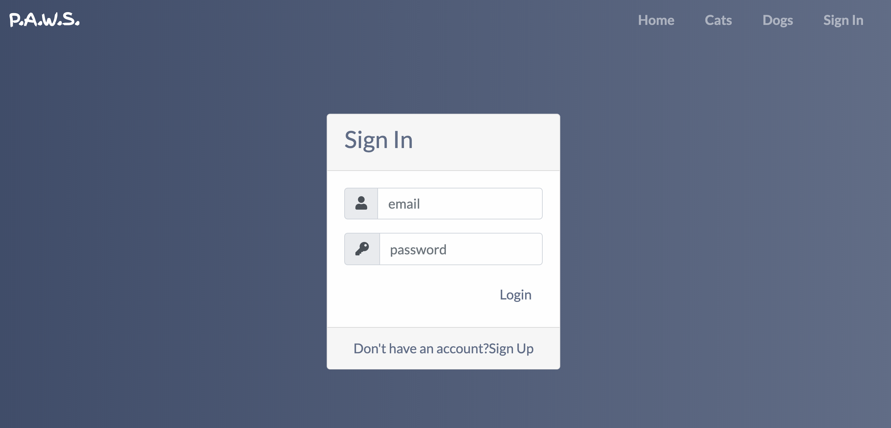
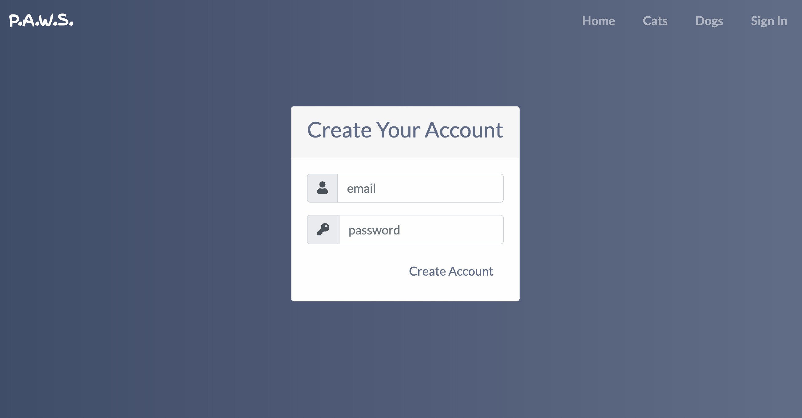

# Pet Adoption Web Service P.A.W.S.
A web app designed to help rehome adoptable animals in your area. This app is complete with user login. After logging in you can upload a profile image and create searches for specific animal types. After your searchers are saved you have the option to receive an email each day with updates about animals available to adopt in your area. 

## Deployed on Heroku 

(http://paws.wtf/)

## Technologies Used: 

  * Sequelize
  * MySQL
  * Handlebars
  * Express 
  * Javascript/ JQuery 
  * Node JS
  * Bootstrap 
  * CSS/HTML
  * Animate.css
  * Sendgrid
  * bcrypt
  * cloudinary
  * cron
  * express-ip
  * multer
  * ngrok
  * favicon.io

## HOW IT WORKS

### Mobil Responsiveness

### Informational Carousel
* This carousel contains useful resources for new pet owners or pet owners to be. 

### Login/Sign Up 
* User can access their profile page after signing in.
* New users can create their account by providing their email and a password 8 characters in length.

## Contributors
* [Bradley Knutson](https://github.com/bradleyknutson)
* [Steven Stott](https://github.com/sstott09)
* [Stacy Holtz](https://github.com/stacyholtz6)

## Acknowledgments
* Background from [uiGradients](https://uigradients.com/)
